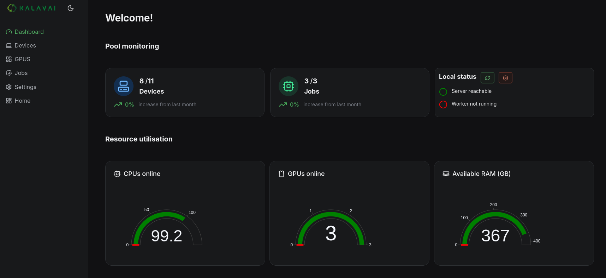

<div align="center">

 
    [](https://discordapp.com/channels/1295009828623880313) [](https://platform.kalavai.net) 

</div>

<!-- ⭐⭐⭐ **Kalavai platform is open source, and free to use in both commercial and non-commercial purposes. If you find it useful, consider supporting us by [giving a star to our GitHub project](https://github.com/kalavai-net/kalavai-client), joining our [discord channel](https://discord.gg/YN6ThTJKbM) and follow our [Substack](https://kalavainet.substack.com/).** -->

### ⭐⭐⭐ Kalavai is now opening a managed service to create and manage AI workloads on a fleet of GPUs. We are inviting Beta Testers for early access. If you are interested [Apply here](https://kalavai.net/beta)


# Kalavai: a platform to self-host AI on easy mode

> AI in the cloud is not aligned with you, it's aligned with the company that owns it. Make sure you own your AI

### Taming the adoption of self-hosted GenAI

Kalavai is an **open source** tool that turns **any devices** into a self-hosted AI platform. It aggregates resources from multiple machines, including cloud, on prem and personal computers, and is **compatible with most model engines** to make model deployment and orchestration simple and reliable.


## What can Kalavai do?

Kalavai's goal is to make using self-hosted AI (GenAI models and agents) in real applications accessible and affordable to all.

### Core features

- Manage **multiple devices resources as one**, wherever they come from (hybrid cloud, on prem, personal devices)
- **Deploy open source models seamlessly across devices**, with zero-cost migration
- Beyond LLMs: not just for large language models, but text-to-speech, speech-to-text, image generation, video understanding, coding generation and embedding models.
- Production-ready: **models are automatically exposed** through a single OpenAI-like API and a ChatGPT-like UI playground, with off-the-shelf monitoring and evaluation framework.
- Compatible with [most popular model engines](#support-for-llm-engines)
- [Easy to expand](https://github.com/kalavai-net/kube-watcher/tree/main/templates) to custom workloads


<details>

**<summary>Powered by Kalavai</summary>**

- [CoGen AI](https://cogenai.kalavai.net): A community hosted alternative to OpenAI API for unlimited inference.
- [Create your own Free Cursor/Windsurf Clone](https://www.youtube.com/watch?v=6zHSo7oeCDQ&t=21s)


</details>


### Latest updates

- 11 June 2025: Native support for Mac and Raspberry pi devices (ARM).
- 20 February 2025: New shiny GUI interface to control LLM pools and deploy models
- 31 January 2025: `kalavai-client` is now a [PyPI package](https://pypi.org/project/kalavai-client/), easier to install than ever!
<details>
<summary>More news</summary>

- 27 January 2025: Support for accessing pools from remote computers
- 9 January 2025: Added support for [Aphrodite Engine](https://github.com/aphrodite-engine/aphrodite-engine) models
- 8 January 2025: Release of [a free, public, shared pool](/docs/docs/public_llm_pool.md) for community LLM deployment
- 24 December 2024: Release of [public BOINC pool](/docs/docs/boinc.md) to donate computing to scientific projects
- 23 December 2024: Release of [public petals swarm](/docs/docs/petals.md)
- 24 November 2024: Common pools with private user spaces
- 30 October 2024: Release of our [public pool platform](https://platform.kalavai.net)

</details>

### Support for AI engines

We currently support out of the box the following AI engines:

- [vLLM](https://docs.vllm.ai/en/latest/): most popular GPU-based model inference.
- [llama.cpp](https://github.com/ggerganov/llama.cpp): CPU-based GGUF model inference.
- [SGLang](https://github.com/sgl-project/sglang): Super fast GPU-based model inference.
- [n8n](https://n8n.io/): no-code workload automation framework.
- [Flowise](https://flowiseai.com/): no-code agentic AI workload framework.
- [Speaches](https://speaches.ai/): audio (speech-to-text and text-to-speech) model inference.
- [Langfuse](https://langfuse.com/): open source evaluation and monitoring GenAI framework.
- [OpenWebUI](https://docs.openwebui.com/): ChatGPT-like UI playground to interface with any models.

Coming soon:

- [diffusers](https://huggingface.co/docs/diffusers/en/index)
- [Aphrodite Engine](https://github.com/aphrodite-engine/aphrodite-engine)
- [Petals](https://github.com/bigscience-workshop/petals)
- [exo](https://github.com/exo-explore/exo)
- [GPUstack](https://docs.gpustack.ai/0.4/overview/)
- [RayServe](https://docs.ray.io/en/latest/serve/index.html)

Not what you were looking for? [Tell us](https://github.com/kalavai-net/kalavai-client/issues) what engines you'd like to see.


> Kalavai is at an **early stage** of its development. We encourage people to use it and give us feedback! Although we are trying to minimise breaking changes, these may occur until we have a stable version (v1.0).


## Want to know more?

- Get a free [Kalavai account](https://platform.kalavai.net) and access unlimited AI.
- Full [documentation](https://kalavai-net.github.io/kalavai-client/) for the project.
- [Join our Substack](https://kalavainet.substack.com/) for updates and be part of our community
- [Join our discord community](https://discord.gg/YN6ThTJKbM)


## Getting started

The `kalavai-client` is the main tool to interact with the Kalavai platform, to create and manage both local and public pools and also to interact with them (e.g. deploy models). Let's go over its installation. 


<details>

<summary>Requirements</summary>

For seed nodes:
- A 64 bits x86 based Linux machine (laptop, desktop or VM)
- [Docker engine installed](https://docs.docker.com/engine/install/ubuntu/) with [privilege access](https://docs.docker.com/engine/containers/run/#runtime-privilege-and-linux-capabilities).

For workers sharing resources with the pool:

- A laptop, desktop or Virtual Machine (MacOS, Linux or Windows; ARM or x86)
- If self-hosting, workers should be on the same network as the seed node. Looking for over-the-internet connectivity? Check out our [managed seeds](https://platform.kalavai.net)
- Docker engine installed (for [linux](https://docs.docker.com/engine/install/ubuntu/), [Windows and MacOS](https://docs.docker.com/desktop/)) with [privilege access](https://docs.docker.com/engine/containers/run/#runtime-privilege-and-linux-capabilities).


</details>


### Install the client

The client is a python package and can be installed with one command:

```bash
pip install kalavai-client
```


## Create a a local, private AI pool

You can create and manage your pools with the new kalavai GUI, which can be started with:

```bash
kalavai gui start
```

This will expose the GUI and the backend services in localhost. By default, the GUI is accessible via [http://localhost:49153](http://localhost:49153). In the UI users can create and join AI pools, monitor devices, deploy LLMs and more.



Check out our [getting started guide](https://kalavai-net.github.io/kalavai-client/getting_started/) for next steps on how to add more workers to your pool, or use our [managed seeds service](https://kalavai-net.github.io/kalavai-client/getting_started/#1b-managed-pools-create-a-seed) for over-the-internet AI pools.


## Enough already, let's run stuff!

For an end to end tour on building your own OpenAI-like service, check our [self-hosted](https://kalavai-net.github.io/kalavai-client/self_hosted_llm_pool/) guide.

Check our [examples](examples/) to put your new AI pool to good use!


## Compatibility matrix

If your system is not currently supported, [open an issue](https://github.com/kalavai-net/kalavai-client/issues) and request it. We are expanding this list constantly.

<details>

**<summary>Hardware and OS compatibility </summary>**

### OS compatibility

Currently **seed nodes** are supported exclusively on linux machines (x86_64 platform). However Kalavai supports mix-pools, i.e. having Windows and MacOS computers as workers.

Since **worker nodes** run inside docker, any machine that can run docker **should** be compatible with Kalavai. Here are instructions for [linux](https://docs.docker.com/engine/install/), [Windows](https://docs.docker.com/desktop/setup/install/windows-install/) and [MacOS](https://docs.docker.com/desktop/setup/install/mac-install/).

The kalavai client, which controls and access pools, can be installed on any machine that has python 3.10+.


### Hardware compatibility:

- `amd64` or `x86_64` CPU architecture for seed and worker nodes.
- `arm64` CPU architecture for worker nodes.
- NVIDIA GPU
- Mac M series, AMD and Intel GPUs are currently not supported ([interested in helping us test it?](https://kalavai-net.github.io/kalavai-client/compatibility/#help-testing-amd-gpus))

</details>

## Roadmap

- [x] Kalavai client on Linux
- [x] [TEMPLATE] Distributed LLM deployment
- [x] Kalavai client on Windows (worker only)
- [x] Kalavai client on Windows WSL2 (seed and worker)
- [x] Self-hosted LLM pools
- [x] Collaborative LLM deployment
- [x] Ray cluster support
- [x] Kalavai client on Mac (worker only)
- [x] Kalavai pools UI
- [ ] Support for AMD GPUs
- [ ] Support for Mac M GPUs
- [x] Docker install path


Anything missing here? Give us a shout in the [discussion board](https://github.com/kalavai-net/kalavai-client/discussions)


## Contribute

- PR welcome!
- [Join the community](https://github.com/kalavai-net/kalavai-client/) and share ideas!
- Report [bugs, issues and new features](https://github.com/kalavai-net/kalavai-client/issues).
- Help improve our [compatibility matrix](#compatibility-matrix) by testing on different operative systems.
- [Follow our Substack channel](https://kalavainet.substack.com/) for news, guides and more.
- [Community integrations](https://github.com/kalavai-net/kube-watcher/tree/main/templates) are template jobs built by Kalavai and the community that makes deploying distributed workflows easy for users. Anyone can extend them and contribute to the repo.

### Star History

[](https://star-history.com/#kalavai-net/kalavai-client&Date)


## Build from source

<details>

<summary>Expand</summary>

Python version >= 3.10.

```bash
sudo add-apt-repository ppa:deadsnakes/ppa
sudo apt update
sudo apt install python3.10 python3.10-dev python3-virtualenv python3-venv
virtualenv -p python3.10 env
source env/bin/activate
sudo apt install  python3.10-venv python3.10-dev -y
pip install -U setuptools
pip install -e .[dev]
```

Build python wheels:
```bash
bash publish.sh build
```

</details>

### Unit tests

To run the unit tests, use:

```bash
python -m unittest
```
