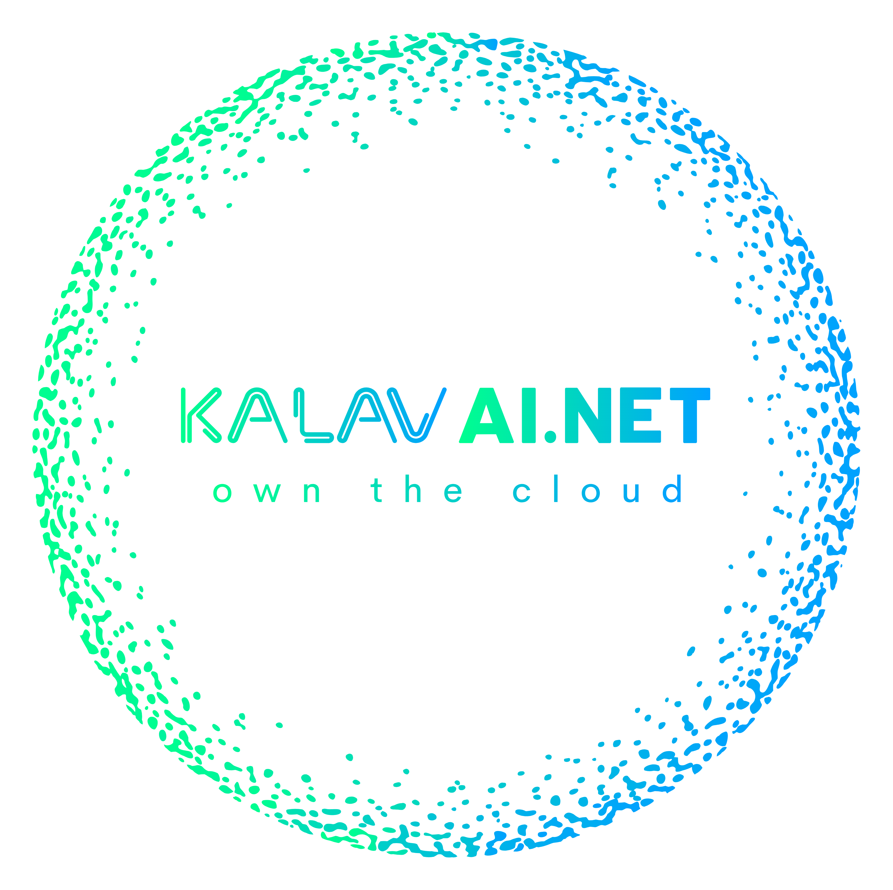

<div align="center">

 
    [](https://discordapp.com/channels/1295009828623880313) [](https://platform.kalavai.net) 

</div>

### ⭐⭐⭐ **Kalavai platform is open source, and free to use in both commercial and non-commercial purposes. If you find it useful, consider supporting us by [giving a star to our GitHub project](https://github.com/kalavai-net/kalavai-client), joining our [discord channel](https://discord.gg/YN6ThTJKbM) and follow our [Substack](https://kalavainet.substack.com/).**


# Kalavai aggregates and coordinates spare GPU capacity

Kalavai is an **open source** platform that unlocks **computing from spare capacity**. It aggregates resources from multiple sources to increase your computing budget and run large AI workloads.  

## Core features

Kalavai helps teams use computing resources more efficiently. It acts as a **control plane for all your computing resources**, wherever they are: local, on prem and multi-cloud. 

- Leverage **multi-platform computing resources**: ARM64 / AMD64 CPUs, GPUs (NVIDIA, AMD).
- Increase GPU utilisation from your devices (fractional GPU).
- Multi-node, multi-GPU deployments. 
- **Ready-made templates to deploy common AI building blocks**: model inference (vLLM, llama.cpp, SGLang), GPU clusters (Ray, GPUStack), automation workflows (n8n and Flowise), evaluation and monitoring tools (Langfuse), production dev tools (LiteLLM, OpenWebUI) and more.
- [Easy to expand](https://github.com/kalavai-net/kalavai-templates) to custom workloads


### Support for AI engines

We currently support out of the box the following AI engines:

- [vLLM](https://docs.vllm.ai/en/latest/): most popular GPU-based model inference.
- [llama.cpp](https://github.com/ggerganov/llama.cpp): CPU-based GGUF model inference.
- [Ray Clusters](https://docs.ray.io/en/latest/serve/index.html) inference.

Coming soon:

- [GPUstack](https://docs.gpustack.ai/0.4/overview/) (experimental)
- [SGLang](https://github.com/sgl-project/sglang): Super fast GPU-based model inference.
- [n8n](https://n8n.io/) (experimental): no-code workload automation framework.
- [Flowise](https://flowiseai.com/) (experimental): no-code agentic AI workload framework.
- [Speaches](https://speaches.ai/): audio (speech-to-text and text-to-speech) model inference.
- [Langfuse](https://langfuse.com/) (experimental): open source evaluation and monitoring GenAI framework.
- [OpenWebUI](https://docs.openwebui.com/): ChatGPT-like UI playground to interface with any models.
- [diffusers](https://huggingface.co/docs/diffusers/en/index) (experimental)
- [RayServe](https://docs.ray.io/en/latest/serve/index.html) inference.
- [GPUstack](https://docs.gpustack.ai/0.4/overview/) (experimental)


Not what you were looking for? [Tell us](https://github.com/kalavai-net/kalavai-client/issues) what engines you'd like to see.


> Kalavai is at an **early stage** of its development. We encourage people to use it and give us feedback! Although we are trying to minimise breaking changes, these may occur until we have a stable version (v1.0).


## Want to know more?

- Full [documentation](https://kalavai-net.github.io/kalavai-client/) for the project.
- [Join our Substack](https://kalavainet.substack.com/) for updates and be part of our community
- [Join our discord community](https://discord.gg/YN6ThTJKbM)


## Getting started

The `kalavai-client` is the main tool to interact with the Kalavai platform, to create and manage GPU pools and also to interact with them (e.g. deploy models). A pool consists of:

- A seed node(s): one (or more for high availability deployments) machine that acts as central control plane 
- One or many worker nodes: any machine connected to the seed node that can carry out workloads (generally with access to a GPU)

Check our [getting started guide](https://kalavai-net.github.io/kalavai-client/getting_started/) for more details.


<details>

<summary>Requirements</summary>

For seed nodes:
- A arm64 or amd64 linux machine (laptop, desktop or VM)
- [Podman engine installed](https://podman.io/docs/installation).

For workers sharing resources with the pool:

- A laptop, desktop or Virtual Machine. Full support: Linux and Windows; amd64 / ARM architecture.
- If self-hosting, workers should be on the same network as the seed node. 
- Podman engine installed (for [your OS](https://podman.io/docs/installation)).


### Compatibility matrix

If your system is not currently supported, [open an issue](https://github.com/kalavai-net/kalavai-client/issues) and request it. We are expanding this list constantly.


</details>

### Pre-requisites

`gcc` compiler and `python3-dev` are required: 

```bash
sudo apt install gcc g++ python3-dev
```

### Install the client

The client is a python package and can be installed with one command:

```bash
pip install kalavai-client
```


## Create a a local private pool

For a quick start, get a pool going with:

```bash
kalavai pool start
```

And then start the GUI:

```bash
kalavai gui start
```

This will expose the GUI and the backend services in localhost. By default, the GUI is accessible via [http://localhost:49153](http://localhost:49153).


Check out our [getting started guide](https://kalavai-net.github.io/kalavai-client/getting_started/) for next steps on how to add more workers to your pool.


## Enough already, let's run stuff!

Check out our use cases documentation for inspiration on what you can do with Kalavai:

- Inference (cpu, gpu and multi gpu)
- Fine tuning (ray and axolotl)
- Unified model portal (Deployer)


## Contribute

Anything missing here? Give us a shout in the [discussion board](https://github.com/kalavai-net/kalavai-client/discussions). We welcome discussions, feature requests, issues and PRs!

- [Join the community](https://github.com/kalavai-net/kalavai-client/) and share ideas!
- Report [bugs, issues and new features](https://github.com/kalavai-net/kalavai-client/issues).
- Help improve our [compatibility matrix](#compatibility-matrix) by testing on different operative systems.
- [Follow our Substack channel](https://kalavainet.substack.com/) for news, guides and more.
- [Community integrations](https://github.com/kalavai-net/kalavai-templates) are template jobs built by Kalavai and the community that makes deploying distributed workflows easy for users. Anyone can extend them and contribute to the repo.

### Star History

[](https://star-history.com/#kalavai-net/kalavai-client&Date)


## Build from source

<details>

### Add Secrets to GitHub

You must store your Docker Hub username and the token you just created as secrets in your GitHub repository:

1. Go to your GitHub repository.

2. Navigate to Settings > Security > Secrets and variables > Actions.

3. Click New repository secret.

4. Create the following two secrets:
```
Name: DOCKER_HUB_USERNAME
Value: Your Docker Hub username or organization name.

Name: DOCKER_HUB_TOKEN
Value: The Personal Access Token you copied from Docker Hub.
```

<summary>Expand</summary>

Python version >= 3.12.

```bash
sudo add-apt-repository ppa:deadsnakes/ppa
sudo apt update
sudo apt install python3-dev gcc python3-venv
python3 -m venv env
source env/bin/activate
pip install -U setuptools
pip install -e .[dev]
```

Build python wheels:
```bash
bash publish.sh build
```

</details>

### Unit tests

To run the unit tests, use:

```bash
python -m unittest
```
