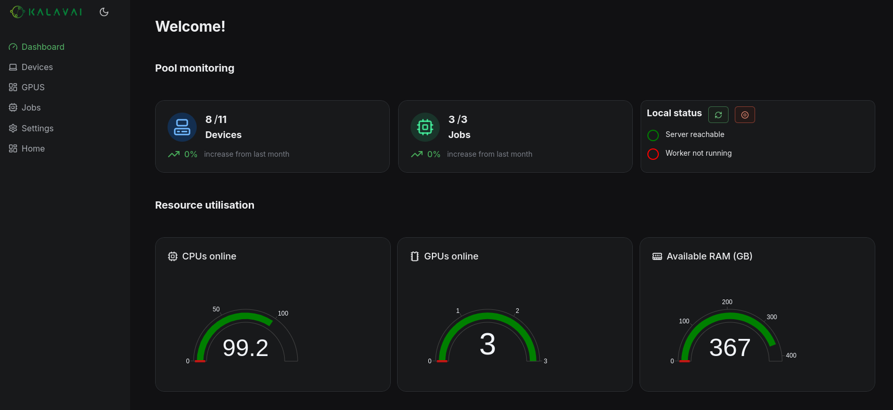
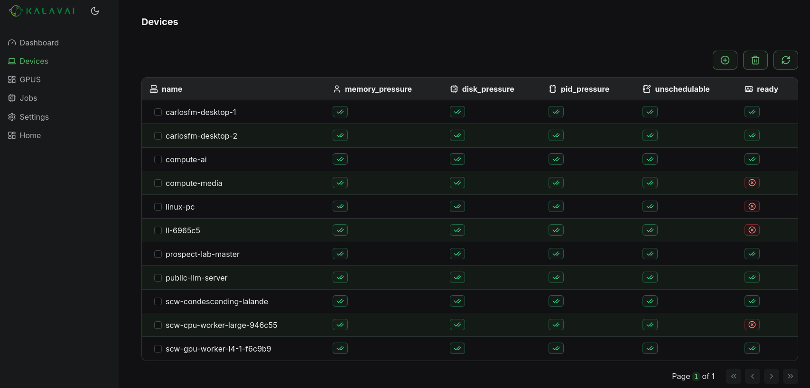
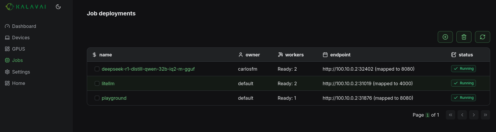

---
tags:
  - kalavai-client
  - cli
  - install
  - requirements
---

# Getting started

The `kalavai` client is the main tool to interact with the Kalavai platform, to create and manage pools and also to interact with them (e.g. deploy models). Let's go over its installation. 


### Requirements to run the client

For seed nodes:

- A 64 bits x86 / ARM64 based Linux-based machine (laptop, desktop or VM)
- [Podman engine installed](https://podman.io/docs/installation).
- Python 3.12+
- `gcc` and `python3-dev` installed

For workers sharing resources with the pool:

- A laptop, desktop or Virtual Machine (MacOS, Linux or Windows; ARM or x86)
- Workers should be on the same network as the seed node (or a shared VPN).
- Podman engine installed (for [your OS](https://podman.io/docs/installation)).
- Python 3.12+
- `gcc` and `python3-dev` installed

#### Ports

Once a machine is part of a pool, the following ports must be enabled and open to accept and process workloads:

**Seed nodes**:

- 2379-2380 TCP inbound/outbound
- 6443 TCP inbound
- 8472 UDP inbound/outbound
- 10250 TCP inbound/outbound
- 51820-51821 UDP inbound/outbound


**Worker nodes**:

- 6443 TCP outbound
- 8472 UDP inbound/outbound
- 10250 TCP inbound/outbound
- 51820-51821 UDP inbound/outbound
- 5121 TCP inbound/outbound


### Install the client

The client is a python package and can be installed with one command:

```bash
pip install kalavai-client
```

Check out specific pre-requisites for [NVIDIA](./nvidia_node.md), [Windows](./windows_node.md) and [AMD](./amd_node.md).


## Create a local, private pool

To create your own computing pool, you will need at least one machine (the seed) and (optionally) one or more workers. See [Kalavai concepts](./index.md#core-components) for an overview of AI pool architecture. Note that **seed machines should always be available for the platform to remain operational**.

You can create a seed by self-hosting the open source platform, limited to same network machines only (or shared VPN).


### 1. Create a seed

In any machine with the `kalavai` client installed, execute the following to start a seed node:
```bash
kalavai pool start <name>
```

Where <name> is the name of the pool. This will deploy a series of containers to manage and interact with the platform. Once the seed is up and running, you can start the GUI manually to manage devices and workloads:

```bash
$ kalavai gui start

[10:11:13] Using ports: [49152, 49153, 49154]                                
[+] Running 2/2
 ✔ Network kalavai_kalavai-net  Created0.1s  
```

And then start the GUI locally:

```bash
kalavai gui start
```

This will expose the GUI and the backend services in localhost. By default, the GUI is accessible via [http://localhost:49153](http://localhost:49153).


### 2. Add worker nodes

> **Important: if you are self hosting seed nodes, only nodes within the same network as the seed node can be added successfully.**

Increase the power of your computing pool by adding resources from other devices. For that, you need to generate a joining token. You can do this by using the seed GUI or the CLI.

**[On the seed node] Using the CLI**

In the terminal, run the following to obtain your joining token:

```bash
kalavai pool token --worker
```

**[On the worker node] Join the pool**

Once you have the joining token, use it on the machines you want to add to the pool. Workers can use the GUI interface to make this step easier too:

From the command line, join with:

```bash
kalavai pool join <TOKEN>
```


### 3. Explore resources

For both seed and worker nodes, the dashboard shows a high level view of the LLM pool: resources available, current utilisation and active devices and deployments.



Use the navigation bar to see more details on key resources:

- **Resources**: every machine and GPU devices connected to the pool and its current status



- **Jobs**: all models and deployments active in the pool




### 4. Leave the pool

Any device can leave the pool at any point and its workload will get reassigned. To leave the pool, use the command line CLI on the worker you wish to disconnect:

```bash
kalavai pool stop
```

You can also remove a worker node from the pool using the pool GUI by navigating to `Resources` and clicking the `x` button next to the device you want to remove.


## What's next

Now that you know how to get a pool up and running, check our [model deployment tutorial](use_cases/model_deployment.md) on how to self-host an LLM with OpenAI compatible API.
