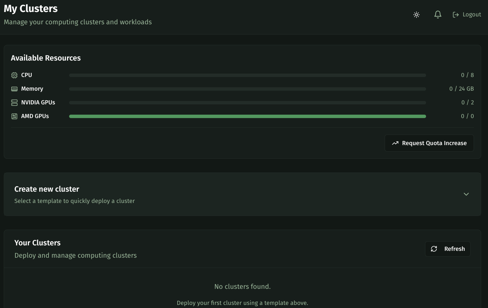
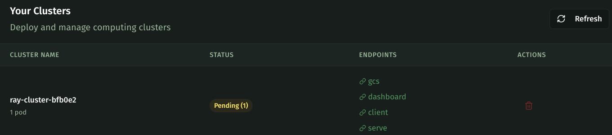

---
tags:
  - ray
  - distributed ML
---

> Beta access only. Register your interest [here](https://kalavai.net/beta)

# Ray in Kalavai

Create, manage and deploy Ray workloads in Kalavai without touching infrastructure.

## What is Ray?

[Ray](https://docs.ray.io/en/latest/index.html) is a distributed framework for scaling Python and ML workloads. Kalavai’s managed Ray clusters let you launch distributed training or inference tasks without setting up or managing nodes.

**Platform features**:

- Create Ray clusters that autoscale to your needs without dealing with infrastructure
- Highly configurable (python version, CUDA kernels, node capabilities)
- Flexible and affordable access to thousands of data centre-level GPUs


## Getting Started

[Log in](https://platform.kalavai.net) to your Kalavai account and navigate to the ```Clusters``` page. This section allows you to create, manage and connect to your GPU clusters. 



As long as you are within your resource quota (as indicated under ```Available Resources```) you can create as many clusters as you need --even multiple of the same type. You can create a cluster by selecting any of the supported templates (growing!) under the ```Create new Cluster``` section.

## Create a Ray cluster

Select ```Ray Cluster``` on the list of cluster templates to configure your Ray cluster.


### Configuring your Ray cluster

The Ray template allows you to configure your cluster instance to your needs. 


Here's a list of key parameters:

- `workers` (default: `1`, required): Number of desired starting workers
- `min_workers` (default: `1`, required): Minimum desired workers for autoscaling
- `max_workers` (default: `1`, required): Maximum workers for autoscaling
- `cpus` (default: `2`, optional): CPUs to be used per single worker (final one = cpus * workers). Workers should have these many CPUs available.
- `gpus` (default: `1`, optional): GPUs to be used per single worker (final one = gpus * workers). Workers should have these many GPUs available.
- `memory` (default: `8`, optional): RAM memory to be used per single worker (final one = memory * workers). Workers should have this much RAM available.
- `cuda_gpu_mem_percentage` (default: `100`, optional): Maximum memory fraction allowed to be used from the GPU vRAM.
- `ray_version` (default: `"2.49.0"`, optional): Ray version to use in the cluster
- `python_version` (default: `"312"`, optional): Python version to use in the cluster (39, 310, 311, 312)
- `cuda_version` (default: `"cu124"`, optional): CUDA version to use in the cluster (cu117 to cu128)
- `upscaling_mode` (default: `"Default"`, optional): Defines autoscale mode. One of: Conservative, Default or Aggressive. [More info](https://docs.ray.io/en/latest/cluster/kubernetes/user-guides/configuring-autoscaling.html#scale-up-and-scale-down-speed)
- `idle_timeout_seconds` (default: `60`, optional): Defines the waiting time in seconds before scaling down an idle worker pod. [More info](https://docs.ray.io/en/latest/cluster/kubernetes/user-guides/configuring-autoscaling.html#scale-up-and-scale-down-speed)

When you are ready, click on `Deploy Cluster`. The Ray instance may take a few minutes to spin up. Check the status of the pool under `Your clusters`.




#### Example: Autoscalable cluster

Autoscalable clusters are ideal to keep cost under control. You can set up a no-GPU cluster that autoscales on demand to up to 10 GPUs based on your workloads. To do so, here are the parameters you can use:

- `workers`: 0
- `min_workers`: 0
- `max_workers`: 10
- `idle_time_out`: 120

With this configuration, you get a 0 GPUs cluster that scales up to 10 GPUs when you send demand to it. Once the demand ceases, each idle worker scales down itself after 120 seconds.


### Connecting to your cluster

Once the status of the cluster is `Ready` you are ready to put the instance to work. Each Ray cluster exposes a list of endpoints:

- `GCS`: Global Control Store, Coordinates communication between the head node and worker nodes.
- `Dashboard`: Provides a web-based monitoring interface for the Ray cluster.
- `Client`: Allows external Python clients (e.g., from your laptop) to connect remotely to a running Ray cluster. Used to connect remotely to your cluster with `ray.init(address=ray://<address>)`. Make sure you **do not use** `http://` within the address and use the `ray://` protocol.
- `Serve`: The HTTP entrypoint for Ray Serve, which is Ray’s model serving layer.


### Python example

To run Ray in python locally and connect to your cluster, first install a matching version of ray library:

```bash
pip install ray[default]==2.49.0 # <-- should match the version on your cluster
```
#### Connect directly from python

```python
# Name: test.py
import ray
ray.init("<client endpoint>")

@ray.remote
def f(x):
    return x * x

futures = [f.remote(i) for i in range(2)]
print(ray.get(futures)) # [0, 1]
```

And execute it locally:

```bash
python test.py
```

**Note** that your local python version must match that of the cluster. If you want to wave this restriction, use the submission route below.


#### Submit script to your cluster

We need to create a python script, put it in its own working folder, then submit it to our cluster.

Create a `raytest.py` script and place it under `raytest/` folder:
```python
import ray

ray.init()

@ray.remote
def f(x):
    return x * x

futures = [f.remote(i) for i in range(2)]
print(ray.get(futures)) # [0, 1]
```

The folder structure should look as follows:

```
raytest/
|
|---raytest.py
```

Now submit your job using the dashboard endpoint in your Ray cluster as `address`.

```bash
ray job submit --working-dir ./raytest --address <dashboard endpoint> -- python raytest.py
```

You should see the output in the console, and can also inspect the job progress by visiting the dashboard endpoint in your browser, under `Jobs`


## What next

Ray [official documentation](https://docs.ray.io/en/latest/) and [examples](https://docs.ray.io/en/latest/ray-overview/examples/index.html).