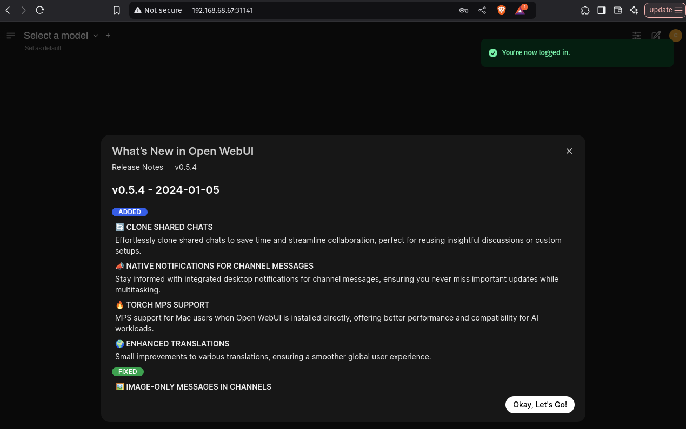

---
tags:
  - crowdsource
  - public
  - shared llm
---

# Deploy and share Large Language Models with community devices

> Beta feature: we are trialing shared pools. If you encounter any issues, please [submit a ticket in our GitHub repo](https://github.com/kalavai-net/kalavai-client/issues).

Shared pools in `Kalavai` are an easy way to expand your computing power beyond a single machine, with zero-devops knowledge. Kalavai **aggregates the GPUs, CPUs and RAM memory** from any compatible machine and makes it ready for LLM workflows. All you need is three steps to get your supercomputing cluster going:

1. Start a pool with the kalavai client
2. Use the joining token to connect other machines to the pool
3. Deploy LLMs with ready-made templates!

In this guide, we'll show **how to join our public shared pool**, ideal for AI developers that want to go beyond the hardware they have access to. This will manage step 1, so you can jump ahead to step 2 and 3. If you are interested in **hosting your own private shared pool**, check out [this one](private_llm_pool.md).


## Pre-requisites

- Install the [`kalavai` client](getting_started.md) in a [compatible](getting_started.md#requirements) computer.
- Create a free account on [our platform](https://platform.kalavai.net).

## Join in

Authenticate your computer using the kalavai client:

```bash
$ kalavai login

Kalavai account details. If you don't have an account, create one at https://platform.kalavai.net                                                                  
User email: <your.account@email.com>
Password: 
[10:56:05] <your.account@email.com> logged in successfully  
```

Get the joining token from [our platform](https://platform.kalavai.net), under Community Pools page. Find the `Public-LLMs` pool and click JOIN to reveal the joining token. Copy and paste the command on your computer:

```bash
kalavai pool join <TOKEN>
```

That's it! Not only you are sharing your computing time with the community, but now you can tap into a large pool of resources (GPUs, CPUs, RAM...), **and** any LLM deployed on them.


## What can you do in the pool?

Public shared pools are both **public** (anyone can join in) and **shared** (raw resources and deployments are accessible by all). This means any user that is part of the pool can check out the models already present in it, run inference on them, an deploy new ones with the resources available.


### A. Use existing models

All users can interact with models within the pool in two ways:

1. Single API endpoint for HTTP requests
2. Unified ChatGPT-like UI playground


#### UI Playground

The pool comes with an OpenWebUI deployment to make it easy to test model inference with LLMs via the browser. To check the endpoint, use the kalavai client to locate the playground deployment:

```bash
$ kalavai job list

┏━━━━━━━━━┳━━━━━━━━━━━━┳━━━━━━━━━━┳━━━━━━━━━━━━━━━━━━━━━━━━━━━━━━━━━━━━━━━━━━┓
┃ Owner   ┃ Deployment ┃ Workers  ┃ Endpoint                                 ┃
┡━━━━━━━━━╇━━━━━━━━━━━━╇━━━━━━━━━━╇━━━━━━━━━━━━━━━━━━━━━━━━━━━━━━━━━━━━━━━━━━┩
│ default │ playground │ Ready: 1 │ http://100.10.0.5:31912 (mapped to 8080) │
└─────────┴────────────┴──────────┴──────────────────────────────────────────┘
```

Within the UI you can select the model you wish to test and have a chat.



_**Note:** the playground is a shared instance to help users test models without code and should not be used in production. You need to create a playground account to access it. This can be different to your Kalavai account details. The creation of a new user is necessary to keep things like user chat history and preferences._


#### Single API endpoint

All interactions to models in the pool are brokered by a [LiteLLM endpoint](https://docs.litellm.ai/docs/) that is installed in the system. To interact with it you need a LITELLM_URL and a LITELLM_KEY.

The `LITELLM_URL` can be found using the kalavai client, as the endpoint of the `litellm-1` deployment:

```bash
$ kalavai job list

┏━━━━━━━━━┳━━━━━━━━━━━━┳━━━━━━━━━━┳━━━━━━━━━━━━━━━━━━━━━━━━━━━━━━━━━━━━━━━━━━┓
┃ Owner   ┃ Deployment ┃ Workers  ┃ Endpoint                                 ┃
┡━━━━━━━━━╇━━━━━━━━━━━━╇━━━━━━━━━━╇━━━━━━━━━━━━━━━━━━━━━━━━━━━━━━━━━━━━━━━━━━┩
│ default │ litellm    │ Ready: 3 │ http://100.10.0.5:30916 (mapped to 4000) │
└─────────┴────────────┴──────────┴──────────────────────────────────────────┘
```

The `LITELLM_KEY` is shown on the Community Pool page of [our platform](https://platform.kalavai.net).


In this example:

- `LITELLM_URL=http://100.10.0.5:30916`
- `LITELLM_KEY=sk-qoQC5lijoaBwXoyi_YP1xA`

#### Check available LLMs

Using cURL:

```bash
curl -X GET "<LITELLM_URL>/v1/models" \
  -H 'Authorization: Bearer <LITELLM_KEY>' \
  -H "accept: application/json" \
  -H "Content-Type: application/json"
```

Using python:

```python
import requests

LITELLM_URL = "http://100.10.0.5:30916"
LITELLM_KEY = "sk-qoQC5lijoaBwXoyi_YP1xA"


def list_models():
    response = requests.get(
        f"{LITELLM_URL}/v1/models",
        headers={"Authorization": f"Bearer {LITELLM_KEY}"}
    )
    return response.json()


if __name__ == "__main__":
    print(
        list_models()
    )
```


#### Use models

Using cURL:

```bash
curl --location '<LITELLM_URL>/chat/completions' \
  --header 'Authorization: Bearer <LITELLM_KEY>' \
  --header 'Content-Type: application/json' \
  --data '{
      "model": "<MODEL_NAME>",
      "messages": [
          {
          "role": "user",
          "content": "what llm are you"
          }
      ]
  }'
```

Using python:

```python
import requests

LITELLM_URL = "http://206.189.19.245:30916"
LITELLM_KEY = "sk-qoQC5lijoaBwXoyi_YP1xA"

def model_inference():
    response = requests.post(
        f"{LITELLM_URL}/chat/completions",
        headers={"Authorization": f"Bearer {LITELLM_KEY}"},
        json={
            "model": "<MODEL_NAME>",
            "messages": [
            {
                "role": "user",
                "content": "what llm are you"
            }]
        }
    )
    return response.json()


if __name__ == "__main__":
    print(
        model_inference()
    )
```

For more details on the endpoint(s) parameters, check out [LiteLLM documentation](https://docs.litellm.ai/docs/simple_proxy) and the [Swagger API](https://litellm-api.up.railway.app/)


### B. Deploy new models

Kalavai makes deployment of new models easy with the use of [templates](https://github.com/kalavai-net/kalavai-client/tree/main/templates) (no-code recipes for model engines). At the moment we support the following engines:

- [vLLM](https://docs.vllm.ai/en/latest/index.html)
- [llama.cpp](https://github.com/ggerganov/llama.cpp)

We are constantly adding new templates, so if your favourite one is not yet available, request it in our [issues page](https://github.com/kalavai-net/kalavai-client/issues).

#### New vLLM model

Here we'll deploy an LLM across 2 machines using vLLM. Check our [template documentation](https://github.com/kalavai-net/kalavai-client/tree/main/templates/vllm) or our [multi-node deployment guide](https://github.com/kalavai-net/kalavai-client/blob/main/examples/multinode_gpu_vllm.md) for more details and parameters with vLLM. Deploying with [llama.cpp](https://github.com/kalavai-net/kalavai-client/blob/main/templates/llamacpp/README.md) is similar too.

You need the LiteLLM KEY of the pool. See [here for details on how to get it](#a-use-existing-models).

Create a `values.yaml` file that will include the parameters to pass to the vLLM engine:

```yaml
- name: litellm_key
  value: "<LITELLM_KEY>"
  default: ""
  description: "Master key of the LiteLLM service (central registry)"

- name: workers
  value: 2
  default: 1
  description: "Number of remote workers (for tensor and pipeline parallelism). This is in addition to the main node"

- name: model_id
  value: Qwen/Qwen2.5-1.5B-Instruct
  default: null
  description: "Huggingface model id to load"

- name: pipeline_parallel_size
  value: 2
  default: 1
  description: "Pipeline parallelism (use the number of nodes)"
```

Use the kalavai client to deploy your model. Choose option `0` to let kalavai select any available GPU device in the pool:

```bash
$ kalavai job run vllm --values values.yaml

Checking current GPU stock...

SELECT Target GPUs for the job (loading models)   
0) Any/None
1) NVIDIA-NVIDIA GeForce RTX 2070 (8GB) (in use: False)
2) NVIDIA-NVIDIA GeForce RTX 3060 (12GB) (in use: False)
3) NVIDIA-NVIDIA GeForce RTX 3050 Ti Laptop GPU (4GB) (in use: False)
-->  : 0

AVOID Target GPUs for the job (loading models) 
0) Any/None
1) NVIDIA-NVIDIA GeForce RTX 2070 (8GB) (in use: False)
2) NVIDIA-NVIDIA GeForce RTX 3060 (12GB) (in use: False)
3) NVIDIA-NVIDIA GeForce RTX 3050 Ti Laptop GPU (4GB) (in use: False)
-->  : 0

Template templates/vllm/template.yaml successfully deployed!  
```

Check progress of your deployment:

```bash
$ kalavai job list

┏━━━━━━━━━┳━━━━━━━━━━━━━━━━━━━━━━━━━━━━┳━━━━━━━━━━━━┳━━━━━━━━━━━━━━━━━━━━━━━━━━━━━━━━━━━━━━━━━━┓
┃ Owner   ┃ Deployment                 ┃ Workers    ┃ Endpoint                                 ┃
┡━━━━━━━━━╇━━━━━━━━━━━━━━━━━━━━━━━━━━━━╇━━━━━━━━━━━━╇━━━━━━━━━━━━━━━━━━━━━━━━━━━━━━━━━━━━━━━━━━┩
│ default │ litellm-1                  │ Ready: 3   │ http://100.10.0.5:30916 (mapped to 4000) │
├─────────┼────────────────────────────┼────────────┼──────────────────────────────────────────┤
│ <user>  │ qwen-qwen2-5-1-5b-instruct │ Ready: 1   │                                          │
│         │                            │ Pending: 2 │                                          │
└─────────┴────────────────────────────┴────────────┴──────────────────────────────────────────┘
```

Your model will appear listed under your user (<user>) ownership. **Note** once all workers are listed as Ready, the model still needs to be loaded onto the machines and thus it may take some time for it to be available through the LiteLLM API. You can check the workers progress:

```bash
kalavai job logs qwen-qwen2-5-1-5b-instruct
```

Once the model is loaded, you can interact with it [as you would with any other model via the LiteLLM API](#a-use-existing-models).


#### Delete deployment

You are welcome to leave the model running for others, but if you wish to remove your deployment, you can do so at any time with the kalavai client:

```bash
kalavai job delete <deployment name>
```

where the <deployment name> is the name listed under `kalavai job list`.


## FAQs

> Work in Progress!

### Why is it free?

We thought the community may be interested in a public version, so we have created a public shared pool that anyone can join. It is truly public (anyone can join) and shared (resources are pooled together, and anyone can see and use each other's LLMs).

We are committed to advancing community computing, and that's why not only we are showing how anyone can create their own pool with their devices, but access to the public instance is free.


<!-- ### What happens if there are not enough resources to deploy my model?


### What if I deploy a model that is already present in the pool?


### I love sharing resources, but I want to deploy a model just for myself


### Can I set boundaries on what I share?


### Can I use my computer whilst sharing?


### Can I stop sharing for a bit and come back later?


### How is this different to X

exo, petals, boinc


### What if there are not enough resources for my model?

### What happens when a machine becomes offline? -->