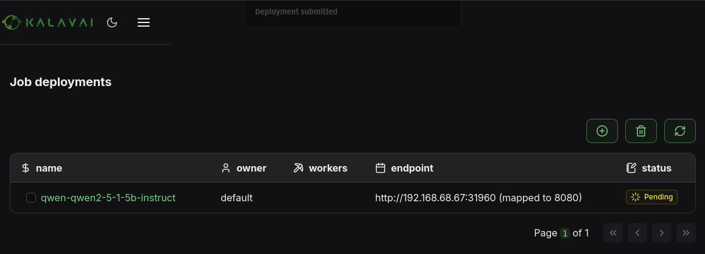

---
tags:
  - crowdsource
  - public
  - LLM pool
  - shared llm
---

# LLM Pools: deploy and orchestrate Large Language Models

⭐⭐⭐ **Kalavai and our LLM pools are open source and free to use in both commercial and non-commercial purposes. If you find it useful, consider supporting us by [giving a star to our GitHub project](https://github.com/kalavai-net/kalavai-client), joining our [discord channel](https://discord.gg/YN6ThTJKbM), follow our [Substack](https://kalavainet.substack.com/) and give us a [review on Product Hunt](https://www.producthunt.com/products/kalavai/reviews/new).**

> Beta feature: we are trialing shared pools. If you encounter any issues, please [submit a ticket in our GitHub repo](https://github.com/kalavai-net/kalavai-client/issues).

🔥🔥🔥 **We have deployed `DeepSeek R1` onto our public LLM pool. Join in to access the most demanded open source model for free. The more people that joins, the bigger models we can deploy**

LLM pools in `Kalavai` are an easy way to expand your computing power beyond a single machine, with zero-devops knowledge. Kalavai **aggregates the GPUs, CPUs and RAM memory** from any compatible machine and makes it ready for LLM workflows. All you need is three steps to get your supercomputing cluster going:

1. Start a pool with the kalavai client
2. Use the joining token to connect other machines to the pool
3. Deploy LLMs with ready-made templates!

In this guide, we'll show **how to join our first public LLM pool**, ideal for AI developers that want to go beyond the hardware they have access to. This will manage step 1, so you can jump ahead to step 2 and 3. If you are interested in **hosting your own private shared pool**, check out [this one](self_hosted_llm_pool.md).


## Pre-requisites

- Install the [`kalavai` client](getting_started.md) in your computer. Make sure it is version __v0.5.12__ or above.

```bash
$ pip show kalavai-client

Name: kalavai-client
Version: 0.5.12
Summary: Client app for kalavai platform
...
```

- Create a free account on [our platform](https://platform.kalavai.net).
- For public pools, **only linux systems are currently supported**. You can also use Windows under WSL (Windows Linux Subsystem). This is a temporary limitation of the public VPN we use.


## Join in

All actions from now on can be taken from within the Kalavai GUI. Run it with:

```bash
$ kalavai gui start

[+] Running 1/1
 ✔ Container kalavai_gui  Started0.1s  
Loading GUI, may take a few minutes. It will be available at http://localhost:3000
```

This will expose the GUI and the backend services in localhost. By default, the GUI is accessible via [http://localhost:3000](http://localhost:3000)

It'll ask you to authenticate. Use your Kalavai account, or [create one for free](https://platform.kalavai.net) if you don't have one.

To join the pool, look for the `Public-LLMs` pool and click join. Select `join` mode.

**Important: Note down the LiteLLM key, as you will need it to register models automatically with the OpenAI-like endpoint and the ChatGPT-like UI playground.**


That's it! Not only you are sharing your computing time with the community, but now you can tap into a large pool of resources (GPUs, CPUs, RAM...), **and** any LLM deployed on them.


## What can you do in the pool?

Public shared pools are both **public** (anyone can join in) and **shared** (raw resources and deployments are accessible by all). This means any user that is part of the pool can check out the models already present in it, run inference on them, an deploy new ones with the resources available.


### A. Use existing models

All users can interact with models within the pool in two ways:

1. Single API endpoint for HTTP requests
2. Unified ChatGPT-like UI playground

Both can be accessed via endpoints private to members of the pool. They are displayed by navigating to `Jobs`.


#### UI Playground

The pool comes with an OpenWebUI deployment (`playground` job) to make it easy to test model inference with LLMs via the browser. Within the UI you can select the model you wish to test and have a chat.


_**Note:** the playground is a shared instance to help users test models without code and should not be used in production. You need to create a playground account to access it. This can be different to your Kalavai account details. The creation of a new user is necessary to keep things like user chat history and preferences._


#### Single API endpoint

All interactions to models in the pool are brokered by a [LiteLLM endpoint](https://docs.litellm.ai/docs/) that is installed in the system. To interact with it you need a LITELLM_URL and a LITELLM_KEY.

The `LITELLM_URL` is the endpoint displayed in the `Jobs` page for the `litellm` job.

The `LITELLM_KEY` is shown on the `My LLM Pools` page of [our platform](https://platform.kalavai.net). It is also displayed in the description of the pool when you join it.


In this example:

- `LITELLM_URL=http://100.10.0.5:30916`
- `LITELLM_KEY=sk-qoQC5lijoaBwXoyi_YP1xA`

#### Check available LLMs

Using cURL:

```bash
curl -X GET "<LITELLM_URL>/v1/models" \
  -H 'Authorization: Bearer <LITELLM_KEY>' \
  -H "accept: application/json" \
  -H "Content-Type: application/json"
```

Using python:

```python
import requests

LITELLM_URL = "http://100.10.0.5:30916"
LITELLM_KEY = "sk-qoQC5lijoaBwXoyi_YP1xA"


def list_models():
    response = requests.get(
        f"{LITELLM_URL}/v1/models",
        headers={"Authorization": f"Bearer {LITELLM_KEY}"}
    )
    return response.json()


if __name__ == "__main__":
    print(
        list_models()
    )
```


#### Use models

Using cURL:

```bash
curl --location '<LITELLM_URL>/chat/completions' \
  --header 'Authorization: Bearer <LITELLM_KEY>' \
  --header 'Content-Type: application/json' \
  --data '{
      "model": "<MODEL_NAME>",
      "messages": [
          {
          "role": "user",
          "content": "what llm are you"
          }
      ]
  }'
```

Using python:

```python
import requests

LITELLM_URL = "http://206.189.19.245:30916"
LITELLM_KEY = "sk-qoQC5lijoaBwXoyi_YP1xA"

def model_inference():
    response = requests.post(
        f"{LITELLM_URL}/chat/completions",
        headers={"Authorization": f"Bearer {LITELLM_KEY}"},
        json={
            "model": "<MODEL_NAME>",
            "messages": [
            {
                "role": "user",
                "content": "what llm are you"
            }]
        }
    )
    return response.json()


if __name__ == "__main__":
    print(
        model_inference()
    )
```

For more details on the endpoint(s) parameters, check out [LiteLLM documentation](https://docs.litellm.ai/docs/simple_proxy) and the [Swagger API](https://litellm-api.up.railway.app/)


### B. Deploy new models

Kalavai makes deployment of new models easy with the use of [templates](https://github.com/kalavai-net/kalavai-client/tree/main/templates) (no-code recipes for model engines). At the moment we support the following engines:

- [vLLM](https://docs.vllm.ai/en/latest/index.html)
- [llama.cpp](https://github.com/ggerganov/llama.cpp)
- [Aphrodite Engine](https://github.com/aphrodite-engine/aphrodite-engine)

Kalavai supports any of the models each of the engines does. For more information, check out [vLLM](https://docs.vllm.ai/en/latest/models/supported_models.html), [llama.cpp](https://github.com/ggerganov/llama.cpp) and [Aphrodite Engine](https://aphrodite.pygmalion.chat/pages/usage/models.html) support lists. 

We are constantly adding new templates, so if your favourite one is not yet available, request it in our [issues page](https://github.com/kalavai-net/kalavai-client/issues).

#### New vLLM model

Here we'll deploy an LLM across 2 machines using vLLM. Check our [template documentation](https://github.com/kalavai-net/kalavai-client/tree/main/templates/vllm) or our [multi-node deployment guide](https://github.com/kalavai-net/kalavai-client/blob/main/examples/multinode_gpu_vllm.md) for more details and parameters with vLLM. Deploying with [llama.cpp](https://github.com/kalavai-net/kalavai-client/blob/main/templates/llamacpp/README.md) is similar too.

You need the `LiteLLM KEY` of the pool. See [here for details on how to get it](#a-use-existing-models).

Navigate to the `Jobs` page and click the `circle-plus` button to create a new deployment. Select the `vLLM` template, and fill up the following fields (leave the rest as default):

```
- litellm_key: "<your LiteLLM Key>"
- workers: 2
- model_id: Qwen/Qwen2.5-1.5B-Instruct
- pipeline_parallel_size: 2
```


To know more information about each parameter, hover the mouse over it. Once you are ready, click `Deploy`.

You can check the progress of your deployment by navigating to the `Jobs` page. Your model will appear listed under your user (<user>) ownership.

Note: _models may take several minutes to be ready, particularly if the model weights are large_. This is due to the time the system takes to 1) download the models from source and 2) distribute them to the memory of each device. This is an overhead that only happens once per deployment.



Once the model status appears as `Running`, you can interact with it [as you would with any other model via the LiteLLM API](#a-use-existing-models).


#### What's next?

Enjoy your new supercomputer, check out our [templates](https://github.com/kalavai-net/kalavai-client/tree/main/templates) and [examples](https://github.com/kalavai-net/kalavai-client/tree/main/examples) for more model engines and [keep us posted](https://discord.gg/YN6ThTJKbM) on what you achieve!


#### How many resources to request?

For this job example we don't need to tweak resource parameters (the model fits in a single worker), but for other models you may need to up the number of workers, desired RAM, etc. For more details on how to choose resources for jobs, [check out this guide](choose_job_resources.md).


#### Delete deployment

You are welcome to leave the model running for others, but if you wish to remove your deployment, you can do so at any time by navigating to the `Jobs` page, selecting the job and clicking the bin icon.


## FAQs

> Work in Progress!

### Why is it free?

We thought the community may be interested in a public version, so we have created a public shared pool that anyone can join. It is truly public (anyone can join) and shared (resources are pooled together, and anyone can see and use each other's LLMs).

We are committed to advancing community computing, and that's why not only we are showing how anyone can create their own pool with their devices, but access to the public instance is free.


<!-- ### What happens if there are not enough resources to deploy my model?


### What if I deploy a model that is already present in the pool?


### I love sharing resources, but I want to deploy a model just for myself


### Can I set boundaries on what I share?


### Can I use my computer whilst sharing?


### Can I stop sharing for a bit and come back later?


### How is this different to X

exo, petals, boinc


### What if there are not enough resources for my model?

### What happens when a machine becomes offline? -->