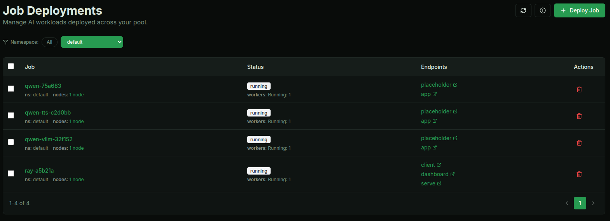
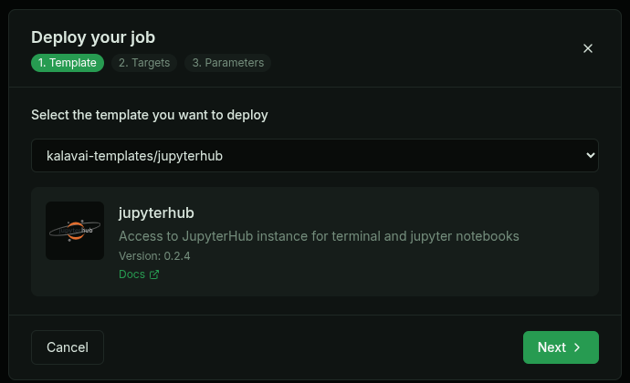

---
tags:
  - low carbon computing
  - pool compute
---


This page contains the details for the [Kalavai workshop](https://lancaster-university.github.io/loco2026/programme) at the 2nd International Workshop on Low Carbon Computing (LOCO'26). 


# Circular AI Infrastructure: Repurposing Existing Compute for Scalable Workloads

Using the Kalavai platform, the session will demonstrate how existing resources can be repurposed to support modern AI workloads, including large language models and custom research pipelines. Attendees will gain practical insight into deploying and managing distributed compute across heterogeneous environments, while extending hardware lifetimes and reducing both cost and environmental impact. The tutorial is particularly relevant for researchers and practitioners seeking scalable AI solutions within constrained or sustainability-focused settings.


## Workshop agenda:

Slide deck available [here](https://docs.google.com/presentation/d/1XP1xT30kTF4GIrf57Bev6WsbYR3dryQ6J6W_FdhHxoU/edit?usp=sharing).

[Part 1](#part-1-using-the-pool):

- Case studies
  - distributed computing with Ray cluster
  - multi-node self hosting of LLMs


[Part 2](#part-2-increasing-compute-resources):

- Increasing computing resources
  - Setting up the environment
  - Connect to a Kalavai pool
- Self-hosted OpenAI-like service (gateway api, access control, monitoring, auto-deployment)
  - Create users for deployer


## [PREP] Setting up the pool

This section is for setting up the pool that will be used during the workshop. In the interest of time, the actual workshop will use a pre-configured pool; these instructions are left here so future users can follow along within their own infrastructure.


### On both seed and worker nodes

Requirements:

- OS: Linux (or WSL in Windows)
- Python: 3.12+
- [Docker](https://docs.docker.com/engine/install/) for your OS
- [Docker compose](https://docs.docker.com/compose/install/) for your OS

1. Install pre-requisites:

```bash
# Python dev libraries (assumed Ubuntu-based linux OS)
sudo apt install python3-dev

# Docker for your system: https://docs.docker.com/engine/install/
```

2. Install Kalavai

```bash
python3 -m venv kalavai
source kalavai/bin/activate
pip install kalavai-client
```

### On the seed node

1. Start the pool

```bash
kalavai pool start --non-interactive
```

2. Generate a joining token for worker nodes

```bash
kalavai pool token --admin
```

### On the worker nodes

> NOTE: For a fully functional pool, worker and seed nodes must be within the same network to be able to communicate with each other. This can be a local network, or a remote VPN.

1. Join the public pool using the token generated in the seed node:

```bash
kalavai pool join <token> --non-interactive
```

Wait for the handshake with the server and the containers to boot up.

2. Test that the node has joined successfully:

```bash
kalavai node list
```

The above command should show `<your hostname>-<random_string>` as a node in the pool.

```
┏━━━━━━━━━━━━━━━━━━━━━━━━━━━━━━━┳━━━━━━━━━━━━━━━━━┳━━━━━━━━━━━━━━━┳━━━━━━━━━━━━━━┳━━━━━━━┳━━━━━━━━━━━━━━━┓
┃ Node name                     ┃ Memory Pressure ┃ Disk pressure ┃ PID pressure ┃ Ready ┃ Unschedulable ┃
┡━━━━━━━━━━━━━━━━━━━━━━━━━━━━━━━╇━━━━━━━━━━━━━━━━━╇━━━━━━━━━━━━━━━╇━━━━━━━━━━━━━━╇━━━━━━━╇━━━━━━━━━━━━━━━┩
│ carlosfm-hp-omnibook-7e492d9d │ False           │ False         │ False        │ True  │ False         │
│ loco2026-serve-a80616a0       │ False           │ False         │ False        │ True  │ False         │
└───────────────────────────────┴─────────────────┴───────────────┴──────────────┴───────┴───────────────┘
```

### Access your pool from any node

You can access and use your pool from any of the nodes (seed and worker). Both [CLI](../cli.md) and [GUI](../gui.md) access are supported. The GUI access is recommended. Start it with:

```bash
kalavai gui start
# It will show the address of the GUI as well as the token to use to gain access
```

The GUI is accessible via the browser, by default on address http://localhost:49153


## Part 1: using the pool

### Multi-modal LLM deployment

To deploy a model on a single node, there are two available templates, based on your hardware, in the `Job` page:

- For CPU-only: llama.cpp
- For GPU (NVIDIA and AMD): vLLM

In this tutorial we'll deploy a CPU-based model using llama.cpp template, and a GPU-based model using vLLM. Once you deploy models, the relevant endpoints will be displayed in the `Jobs` page.




#### Text model with llama.cpp

In your Kalavai Pool GUI, go to `Jobs` and create a new job. Select `llama.cpp` as the template and configure the resources you need. Configure the following advanced parameters:

- `hfToken`: Your Hugging Face token to access private models and uncapped downloads.
- `llamacpp.repoId`: unsloth/Qwen3.5-0.8B-GGUF
- `llamacpp.quant`: q4_k_m

Once the deployment is completed, use the displayed endpoint in your code for inference. [Here is a reference example of text inference](../inference/text_inference.md#1-streaming-inference).


#### Text model with vLLM

In your Kalavai Pool GUI, go to `Jobs` and create a new job. Select `vLLM` as the template and configure the resources you need. Configure the following advanced parameters:

- `hfToken`: Your Hugging Face token to access private models and uncapped downloads.
- `modelId`: Qwen/Qwen3.5-0.8B

Once the deployment is completed, use the displayed endpoint in your code for inference. [Here is a reference example of text inference](../inference/text_inference.md#1-streaming-inference).


#### Text-to-speech model with vLLM

In your Kalavai Pool GUI, go to `Jobs` and create a new job. Select `vLLM` as the template and configure the resources you need. Configure the following advanced parameters:

- `hfToken`: Your Hugging Face token to access private models and uncapped downloads.
- `modelId`: Qwen/Qwen3-TTS-12Hz-0.6B-CustomVoice
- `vllm.extra`: `--omni --enforce-eager --trust-remote-code --max-model-len 4000`

Once the deployment is completed, use the displayed endpoint in your code snippet for inference. [Here is an example of how to do TTS](../inference/tts_inference.md#1-text-to-speech-inference).


### Distributed computing

[Ray](https://docs.ray.io/en/latest/index.html) is a distributed framework for scaling Python and ML workloads. Kalavai’s managed Ray clusters let you launch distributed training or inference tasks without setting up or managing nodes.

**To deploy**: In your Kalavai Pool GUI, go to `Jobs` and create a new job. Select `Ray Cluster` as the template and configure the resources you need. The main default values are:


- `ray.minNvidiaWorkers`: Used for autoscaling workers. Minimum NVIDIA GPU workers to always have running (can be 0). 1 worker == 1 GPU
- `ray.maxNvidiaWorkers`: Used for autoscaling workers. Maximum NVIDIA GPU workers to scale up to when needed.
- `deployment.cpus`: CPU cores per worker node.
- `deployment.memory`: RAM memory (GB) per worker node.
- `deployment.gpuMemory`: GPU vRAM memory (GB) per worker node.

Once the deployment is completed, you'll have a series of endpoints to use and manage the Ray Cluster:

- `client`: programming endpoint to submit Ray jobs to.
- `dashboard`: GUI endpoint to see the Ray cluster dashboard in the browser.

See [here an example of how to deploy a fine tuning job](../use_cases/fine_tuning.md) on your Ray cluster.


### Interactive AI workloads

[JupyterHub](https://jupyter.org/hub) is a multi-user server for Jupyter notebooks. It allows multiple users to access Jupyter notebooks in a shared environment. It's great for AI development and an easy way to interact with GPU-based machines without the complexity of SSH connections.

**To deploy**: In your Kalavai Pool GUI, go to `Jobs` and create a new job. Select `JupyterHub` as the template and configure the GPU resources you need. The default values are:

```
# credentials to access JupyterHub instance
username: user
password: password
```



More info [here](../deployer/jupyterhub.md).


## Part 2: Create the first LOCO community computing pool


**The seed pool and all the worker nodes will only be available during the workshop!**

> Note: `kalavai` does not install in your system directly; it works as a series of docker containers that run semi-isolated from your system. However, note that those containers run in privilege mode to be able to access the GPU. When connecting to a public pool, new network interfaces are created to connect to a common VPN. These are destroyed once the [clean up steps](#clean-up) are completed.

Now that we know what Kalavai pools are and what we can do with them, let's attempt to pull all participant resources together in a single pool.

First, make sure you have [configured and installed all pre-requisites](#on-both-seed-and-worker-nodes) and make sure you have installed the `kalavai-client` with version >= 0.10.6.

Then you should be ready to join the pool with just one command:

```bash
kalavai pool join eyJjbHVzdGVyX2lwIjogIjEwMC45Ny4xMTEuMSIsICJjbHVzdGVyX25hbWUiOiAia2FsYXZhaV9jbHVzdGVyIiwgImNsdXN0ZXJfdG9rZW4iOiAiSzEwZDE0OWIwZTY1MTEwYTM5N2M0YjI4Mzc3MGFlMDljMmNhNzA4NGEwNDdmZTEzNzdmMzdiNjBmM2EwYWZlYTU0Yjo6c2VydmVyOmFjZmZhNTk2YmY4NTNkZjZhODFiY2I1OTgzMmU0OTY3XG4iLCAid2F0Y2hlcl9hZG1pbl9rZXkiOiAiZGFhYWRiMDUtZDBlNS00MDEzLTliOTItMDExN2VkNGYxNjQyIiwgIndhdGNoZXJfc2VydmljZSI6ICIxMDAuOTcuMTExLjE6MzAwMDEiLCAicHVibGljX2xvY2F0aW9uIjogImV5SnpaWEoyWlhJaU9pSmhjR2t1ZG5CdUxtdGhiR0YyWVdrdWJtVjBJaXdpZG1Gc2RXVWlPaUpRTlU5RU4wOU9TRFV5VlU1WE5FZElORmMxVWxWTVZFNVZSbE5GTWpOV1R5SjkifQ== --non-interactive
```

If all has gone well, you can display the list of nodes in the pool, which should include your machine.

```bash
kalavai node list
```

The above command should show `<your hostname>-<random_string>` as a node in the pool.

```
┏━━━━━━━━━━━━━━━━━━━━━━━━━━━━━━━┳━━━━━━━━━━━━━━━━━┳━━━━━━━━━━━━━━━┳━━━━━━━━━━━━━━┳━━━━━━━┳━━━━━━━━━━━━━━━┓
┃ Node name                     ┃ Memory Pressure ┃ Disk pressure ┃ PID pressure ┃ Ready ┃ Unschedulable ┃
┡━━━━━━━━━━━━━━━━━━━━━━━━━━━━━━━╇━━━━━━━━━━━━━━━━━╇━━━━━━━━━━━━━━━╇━━━━━━━━━━━━━━╇━━━━━━━╇━━━━━━━━━━━━━━━┩
│ carlosfm-hp-omnibook-7e492d9d │ False           │ False         │ False        │ True  │ False         │
│ loco2026-serve-a80616a0       │ False           │ False         │ False        │ True  │ False         │
└───────────────────────────────┴─────────────────┴───────────────┴──────────────┴───────┴───────────────┘
```

Once you join, you can manage the pool via the browser GUI:

```bash
kalavai gui start
# It will show the address of the GUI as well as the token to use to gain access
```

The GUI is accessible via the browser, by default on address http://localhost:49153

**Now we should be ready to deploy a large mode across all of our computers! (live only)**


### Clean up

Once you are done, you can remove your worker machine from the pool as follows:

```bash
kalavai pool stop
```

This will disconnect you from the public pool and remove all running containers.