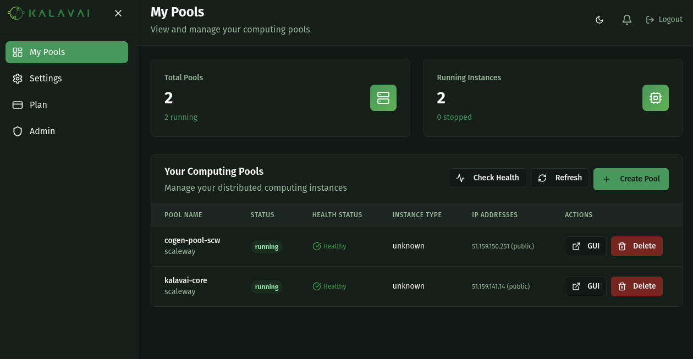
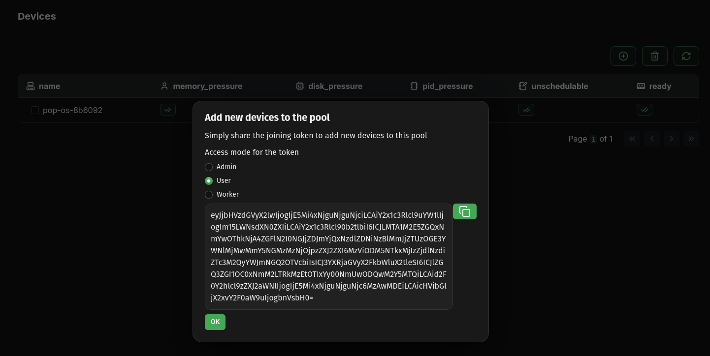

---
tags:
  - kalavai-client
  - cli
  - install
  - requirements
---

# Getting started

The `kalavai` client is the main tool to interact with the Kalavai platform, to create and manage pools and also to interact with them (e.g. deploy models). Let's go over its installation. 

From release **v0.5.0, you can now install `kalavai` client in non-worker computers**. You can run a pool on a set of machines and have the client on a remote computer from which you access the LLM pool. Because the client only requires having python installed, this means more computers are now supported to run it.


### Requirements to run the client

For seed nodes:

- A 64 bits x86 based Linux machine (laptop, desktop or VM)
- [Docker engine installed](https://docs.docker.com/engine/install/ubuntu/) with [privilege access](https://docs.docker.com/engine/containers/run/#runtime-privilege-and-linux-capabilities).
- Python 3.12+

For workers sharing resources with the pool:

- A laptop, desktop or Virtual Machine (MacOS, Linux or Windows; ARM or x86)
- If self-hosting, workers should be on the same network as the seed node. Looking for over-the-internet connectivity? Check out our [managed service](https://platform.kalavai.net)
- Docker engine installed (for [linux](https://docs.docker.com/engine/install/ubuntu/), [Windows and MacOS](https://docs.docker.com/desktop/)) with [privilege access](https://docs.docker.com/engine/containers/run/#runtime-privilege-and-linux-capabilities).
- Python 3.12+

#### Ports

Once a machine is part of a pool, the following ports must be enabled and open to accept and process workloads:

**Seed nodes**:

- 2379-2380 TCP inbound/outbound 
- 6443 TCP inbound
- 8472 UDP inbound/outbound
- 10250 TCP inbound/outbound
- 51820-51821 UDP inbound/outbound


**Worker nodes**:

- 6443 TCP outbound
- 8472 UDP inbound/outbound
- 10250 TCP inbound/outbound
- 51820-51821 UDP inbound/outbound
- 5121 TCP inbound/outbound


### Install the client

The client is a python package and can be installed with one command:

```bash
pip install kalavai-client
```


## Create a local, private pool

To create your own GPU pool, you will need at least one machine (the seed) and (optionally) one or more workers. See [Kalavai concepts](./index.md#core-components) for an overview of AI pool architecture. Note that **seed machines should always be available for the platform to remain operational**.

You can create a seed by self-hosting the open source platform (limited to same network machines only) or using our managed pools service (pre-configured, hosted seed with over-the-internet workers from everywhere).

### 1a. [Self hosted] Create a seed

**Note: Currently seed nodes are only supported in Linux x86_64 machines.** 

In any machine with the `kalavai` client installed, execute the following to start a seed node:
```bash
kalavai pool start <name>
```

Where <name> is the name of the pool. This will deploy a series of docker containers to manage and interact with the platform. Once the seed is up and running, you can start the GUI manually to manage devices and workloads:

```bash
$ kalavai gui start

[10:11:13] Using ports: [49152, 49153, 49154]                                
[+] Running 2/2
 ✔ Network kalavai_kalavai-net  Created0.1s  
 ✔ Container kalavai_gui        Started0.4s  
           Loading GUI, may take a few minutes. It will be available at       
           http://localhost:49153
```

By default, the GUI is available via your browser at http://localhost:49153 (but note the port may change depending on port availability).


### 1b. [Managed pools] Create a seed

We offer a service to [host and manage seed nodes](https://platform.kalavai.net) with the following advantages:
- Connect worker nodes from anywhere (over-the-internet)
- Always on to keep your AI pool operational.
- Great if you don't have a linux x86_64 machine to use as a seed.

Create a [free account on our platform](https://platform.kalavai.net). Then, navigate to `My Pools` to manage and create seed nodes for your pools:



Once your seed is up and running and the status is `Healthy`, follow the on-screen instructions to access it via remote GUI.


### 2. Add worker nodes

> **Important: if you are self hosting seed nodes, only nodes within the same network as the seed node can be added successfully. This limitation does not apply to our managed seeds**

Increase the power of your GPU pool by adding resources from other devices. For that, you need to generate a joining token. You can do this by using the seed GUI or the CLI.

**[On the seed node] Using the GUI**

Use the navigation panel to go to `Devices`, and then click the `circle-plus` button to add new devices. You can select the `Access mode`, which determine the level of access new nodes will have over the pool:
- `admin`: Same level of access than the seed node, including generating new joining tokens and deleting nodes.
- `user`: Can deploy jobs, but lacks admin access over nodes.
- `worker`: Workers carry on jobs, but cannot deploy their own jobs or manage devices.



**[On the seed node] Using the CLI**

**Alternatively**, if you do not want to use the GUI, you can join from the command-line. Run the following to obtain your joining token:

```bash
kalavai pool token --worker
```

**[On the worker node] Join the pool**

Once you have the joining token, use it on the machines you want to add to the pool. Workers can use the GUI interface to make this step easier too:

From the command line, join with:

```bash
kalavai pool join <TOKEN>
```


### 3. Explore resources

For both seed and worker nodes, the dashboard shows a high level view of the LLM pool: resources available, current utilisation and active devices and deployments.


Use the navigation bar to see more details on key resources:

- **Resources**: every machine and GPU devices connected to the pool and its current status


- **Jobs**: all models and deployments active in the pool


### 4. Leave the pool

Any device can leave the pool at any point and its workload will get reassigned. To leave the pool, use the command line CLI on the worker you wish to disconnect:

```bash
kalavai pool stop
```

## What's next

Now that you know how to get a pool up and running, check our [end to end tutorial](self_hosted_llm_pool.md) on how to self-host an LLM Pool with OpenAI compatible API and a ChatGPT-like interface for all your LLM models.
