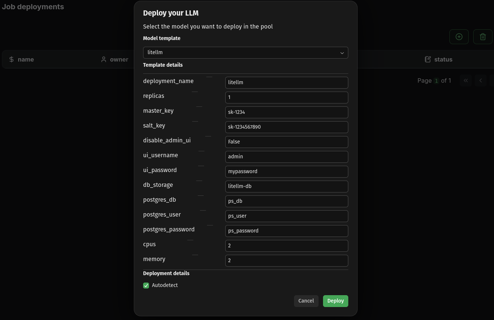
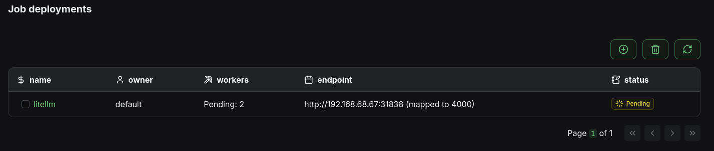
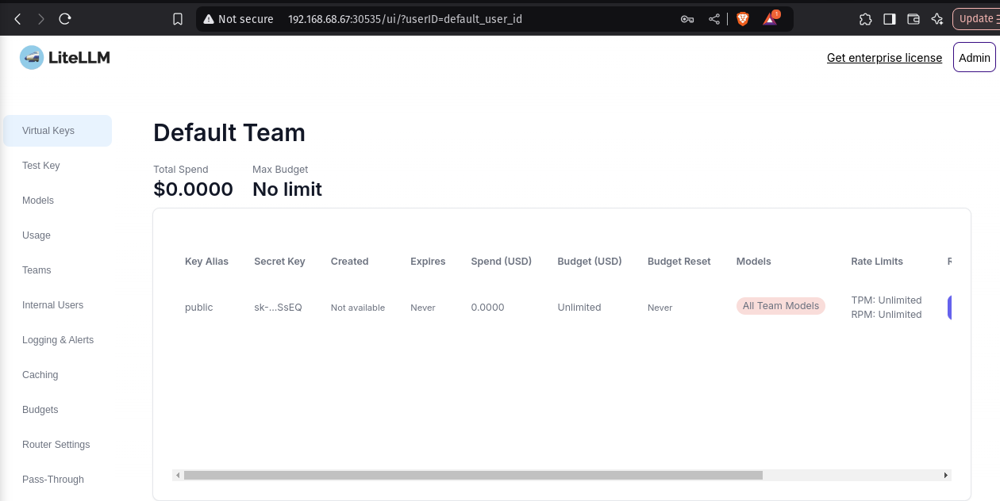
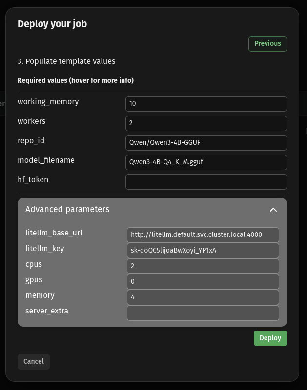

---
tags:
  - gateway
  - litellm
  - openai api
---


A unified LLM gateway API gives all your model deployments a single interface so client applications can reach all your models with the same endpoint. Furthermore, it also provides extra production features such as access control, budgeting, monitoring and tracing.


## 1. Pre-requisites

- [Install kalavai CLI](getting_started.md#getting-started) on each machine
- Set up a [2 machine LLM pool](getting_started.md), i.e. a seed node and one worker


### Unified OpenAI-like API

Model templates deployed in LLM pools have an optional key parameter to register themselves with a LiteLLM instance. [LiteLLM](https://docs.litellm.ai/docs/) is a powerful API that unifies all of your models into a single API, making developing apps with LLMs easier and more flexible.

Our [LiteLLM](https://github.com/kalavai-net/kalavai-client/tree/main/templates/litellm) template automates the deployment of the API across a pool, database included. To deploy it using the Kalavai GUI, navigate to `Jobs`, then click on the `circle-plus` button, in which you can select a `litellm` template.



Once the deployment is complete, you can check the LiteLLM endpoint by navigating to `Jobs` and seeing the corresponding endpoint for the `litellm` job.



You will need a virtual key to register models with LiteLLM. For testing you can use the master key defined in your values.yaml under `master_key`, but it is recommended to generate a virtual one that does not have privilege access. The easiest way of doing so is via the admin UI, under http://192.168.68.67:30535/ui (see more details [here](https://docs.litellm.ai/docs/proxy/virtual_keys)).

```
Example virtual key: sk-rDCm0Vd5hDOigaNbQSSsEQ
```




## 3. Deploy models with compatible frameworks

In this section, we'll look into how to deploy a model with another of our supported model engines: [llama.cpp](https://github.com/kalavai-net/kalavai-client/blob/main/templates/llamacpp/README.md). You can use the kalavai CLI to deploy jobs (via kalavai job deploy) but here we'll use the much simpler GUI route.

Just like we did for LiteLLM and Playground, you can deploy a model by navigating to the Jobs page and clicking the `circle-plus` button. Select `llamacpp` as model template, and populate the following values:

- `working_memory`: 10 (enough free space GBs to fit the model weights)
- `workers`: 2 (this will distribute the model onto our 2 machines)
- `repo_id`: Qwen/Qwen3-4B-GGUF (the [repo id](https://huggingface.co/Qwen/Qwen3-4B-GGUF) from Huggingface)
- `model_filename`: Qwen3-4B-Q4_K_M.gguf (the [filename](https://huggingface.co/Qwen/Qwen3-4B-GGUF/tree/main) of the quantized version we want)
- `hf_token`: <your Huggingface token> if using a gated model (in this case it's not needed)
- `litellm_key`: sk-qoQC5lijoaBwXoyi_YP1xA (Advanced parameter; the virtual key generated above for LiteLLM. **This is key to make sure models are self registering to both LiteLLM and the playground.**)




## 4. Access your models

Once they are donwloaded and loaded into memory, your models will be readily available both via the LiteLLM API as well as through the UI Playground. 


### Single API endpoint

All interactions to models in the pool are brokered by a [LiteLLM endpoint](https://docs.litellm.ai/docs/) that is installed in the system. To interact with it you need the following:

- The `LITELLM_URL` is the endpoint displayed in the `Jobs` page for the `litellm` job.
- The `LITELLM_KEY` is the one you have generated above.
- The `MODEL_NAME` you want to use (the job name displayed in the `Jobs` page)

In this example:

- `LITELLM_URL=http://192.168.68.67:30535`
- `LITELLM_KEY=sk-qoQC5lijoaBwXoyi_YP1xA`
- `MODEL_NAME=qwen3_qwen3_4b_gguf_qwen3_4b_q4_k_m_gguf`

### Check available LLMs

Using cURL:

```bash
curl -X GET "<LITELLM_URL>/v1/models" \
  -H 'Authorization: Bearer <LITELLM_KEY>' \
  -H "accept: application/json" \
  -H "Content-Type: application/json"
```

Using python:

```python
import requests

LITELLM_URL = "http://192.168.68.67:30535"
LITELLM_KEY = "sk-qoQC5lijoaBwXoyi_YP1xA"


def list_models():
    response = requests.get(
        f"{LITELLM_URL}/v1/models",
        headers={"Authorization": f"Bearer {LITELLM_KEY}"}
    )
    return response.json()


if __name__ == "__main__":
    print(
        list_models()
    )
```


### Use models

See inference section.


## 5. Clean up

To remove any model deployment, navigate to the `Jobs` page, select the job (checkbox next to its name) and click the `bin` icon on top of the table. This will remove the deployment from any worker involved and free its resources.

